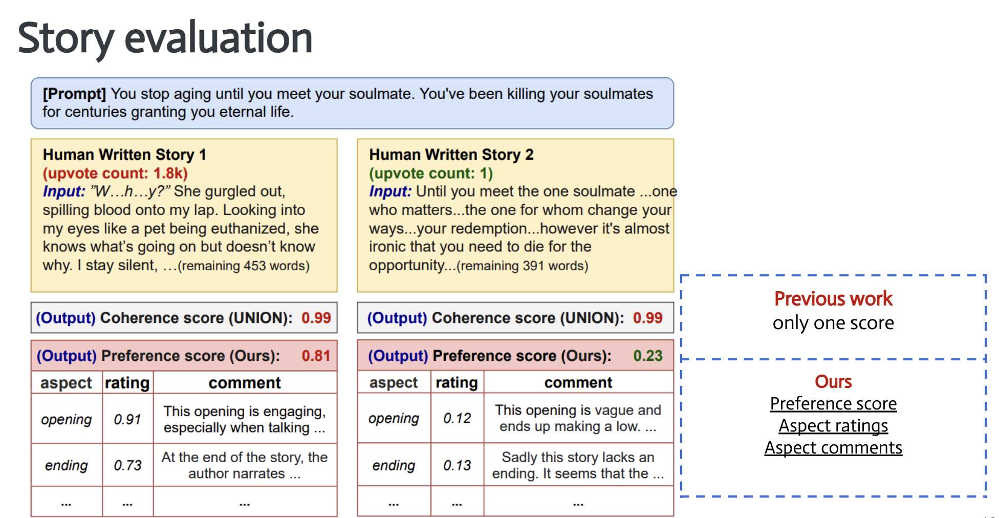

# StoryER: Automatic Story Evaluation via Ranking, Rating and Reasoning

  - Demo
 http://storytelling-lab.com/eval/
 
 ## Overview

# Preprocessed Dataset
You can download full dataset from here!
[https://drive.google.com/file/d/1KyPdxGdEFoVvOByfrsUpL5QNAIkn12We/view?usp=sharing](https://drive.google.com/file/d/1KyPdxGdEFoVvOByfrsUpL5QNAIkn12We/view?usp=sharing)

## Train model
Run python train.py

## Pretrained model
Trained model could be found here!
[https://drive.google.com/drive/folders/1YEgsd9GF5--HuTquldsnKrV5irtt1MxW?usp=sharing](https://drive.google.com/drive/folders/1YEgsd9GF5--HuTquldsnKrV5irtt1MxW?usp=sharing)
